<div align="center">

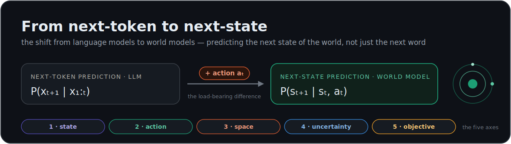

# Awesome Next-State Prediction · World Models

**From next-token to next-state — a curated, opinionated map of the systems that learn to predict the next *state of the world*, not just the next *token*.**

[](https://awesome.re)
[](LICENSE)
[](CONTRIBUTING.md)
[](https://chaoyue0307.github.io/awesome-next-state-prediction/)
[](#the-collection)

*A living index of world models, organized by one question: **what does each system treat as "the next state"?***

</div>

---

> [!NOTE]
> This is not just a link dump. Every entry is tagged with **the next-state it predicts** — its state representation, whether it is action-conditioned, what space it predicts in, and how it carries uncertainty. The thesis below and the [Five Axes](#the-five-axes-of-next-state-prediction) are the lens; the [collection](#the-collection) is the evidence. **Explore it interactively → [chaoyue0307.github.io/awesome-next-state-prediction](https://chaoyue0307.github.io/awesome-next-state-prediction/)**

## Contents

- [The thesis: why "next state" and not "next token"](#the-thesis)
- [The Five Axes of next-state prediction](#the-five-axes-of-next-state-prediction)
- [The landscape map](#the-landscape-map)
- [The Next-State Ladder (L0–L5)](#the-next-state-ladder)
- [Landmark figures](#landmark-figures)
- [How to read every entry](#how-to-read-every-entry)
- [**The collection**](#the-collection)
  - [Neuroscience & cognitive science](#neuroscience--cognitive-science)
  - [Algorithmic precursors](#algorithmic-precursors)
  - [Latent world models for control](#latent-world-models-for-control)
  - [Self-predictive & non-generative (JEPA family)](#self-predictive--non-generative-jepa-family)
  - [Generative video & game world models](#generative-video--game-world-models)
  - [LLMs as implicit world models](#llms-as-implicit-world-models)
  - [Surveys & meta](#surveys--meta)
- [Comparison table](#comparison-table)
- [Timeline](#timeline)
- [Open problems & frontiers](#open-problems--frontiers)
- [How to read a world-model paper (checklist)](#how-to-read-a-world-model-paper)
- [Glossary](#glossary)
- [Contributing](#contributing) · [Citation](#citation) · [License](#license)

---

## The thesis

A large language model is trained on one objective: **predict the next token**.

$$P(x_{t+1} \mid x_{1:t}), \qquad x \in \text{discrete vocabulary}$$

A world model is trained on a different one: **predict the next state**, given what you *do*.

$$P(s_{t+1} \mid s_t, a_t), \qquad s \in \text{continuous / latent state space}$$

Three things changed, and each is load-bearing:

1. **The variable** moved from a *token* (a symbol in a human-authored stream) to a *state* (a representation of the world itself).
2. **The conditioning** gained an **action** $a_t$. This is the deepest change: it turns prediction from *observational* ("what text usually follows?") into *interventional* ("what happens if I **do** this?"). That is the difference between a model of correlations and a model of **cause and effect** — Pearl's `do(·)` operator, baked into the loss.
3. **The space** of prediction became a choice — raw pixels, discrete tokens, a compressed latent, or an abstract state that only keeps what planning needs.

> **One sentence to hold the whole field:** *An LLM models the **text about** the world; a world model models the world's **dynamics under your actions** — and a good-enough text predictor is forced to grow a partial world model inside it anyway, bounded by whatever humans bothered to write down.*

That last clause is why the slogan "*next-token = LLM, next-state = world model*" is **half deep-truth, half straw-man**. Next-token prediction provably *induces* latent world structure (see [Othello-GPT](#llms-as-implicit-world-models)). But text is a lossy, low-bandwidth, un-actioned projection of reality — so pure text prediction has a ceiling for anything embodied or physical. The world-model program is really an argument for **richer state + action-conditioning + prediction in the right space**, not against prediction itself.

---

## The Five Axes of next-state prediction

Don't read this field as two camps. Read it as a **design space**. Place any system on these five axes and you understand it — and you can see exactly what makes it different from an LLM.

| # | Axis | The question | One extreme → the other |
|---|------|--------------|--------------------------|
| **1** | **State** | What *is* the "state"? | discrete token → pixel frame → compressed latent → abstract/value-equivalent state |
| **2** | **Conditioning** | Is the next state conditioned on an **action**? | observational (correlation) → interventional (causation) |
| **3** | **Prediction space** | *Where* do you predict? | raw observation space → abstract representation space |
| **4** | **Uncertainty** | How is a *distribution* over next states represented? | point estimate → softmax → stochastic latent → diffusion → energy |
| **5** | **Objective** | What is the model *for*? | reconstruction / likelihood → planning utility (value-equivalence) |

A few sharp consequences worth internalizing:

- **Axis 2 is the watershed.** Remove the action and "next-state prediction" collapses back into "next-token prediction." It is the single symbol that separates a *simulator* from a *language model*.
- **Axis 3 is the live debate.** Predicting raw pixels is wasteful and ill-posed (the future is multimodal; MSE collapses to a blurry mean). [JEPA](#self-predictive--non-generative-jepa-family) says *never reconstruct — predict in representation space*. [DIAMOND](#generative-video--game-world-models) says *visual detail matters — reconstruct with diffusion*. Both ship strong systems. This is unsettled, and it is the most interesting fault line in the field.
- **Axis 4 is why discreteness is a cheat code.** Tokens get a free probability distribution from the softmax. Continuous states don't — so the field reinvents it with categorical latents (Dreamer), diffusion (DIAMOND, Sora), or energy scoring (JEPA).
- **Axis 5 is the most counter-intuitive.** [MuZero](#latent-world-models-for-control) never reconstructs *anything*. Its "state" exists only to predict reward, value, and policy. A world model does not have to model the world — only the part of it that changes your decisions.

---

## The landscape map

Plot every system on two of the axes — **what it predicts** (Axis 3, x) and **whether it is action-conditioned** (Axis 2, y) — and the whole field organizes itself into four quadrants. This is the single most useful picture in this repo.

<div align="center">
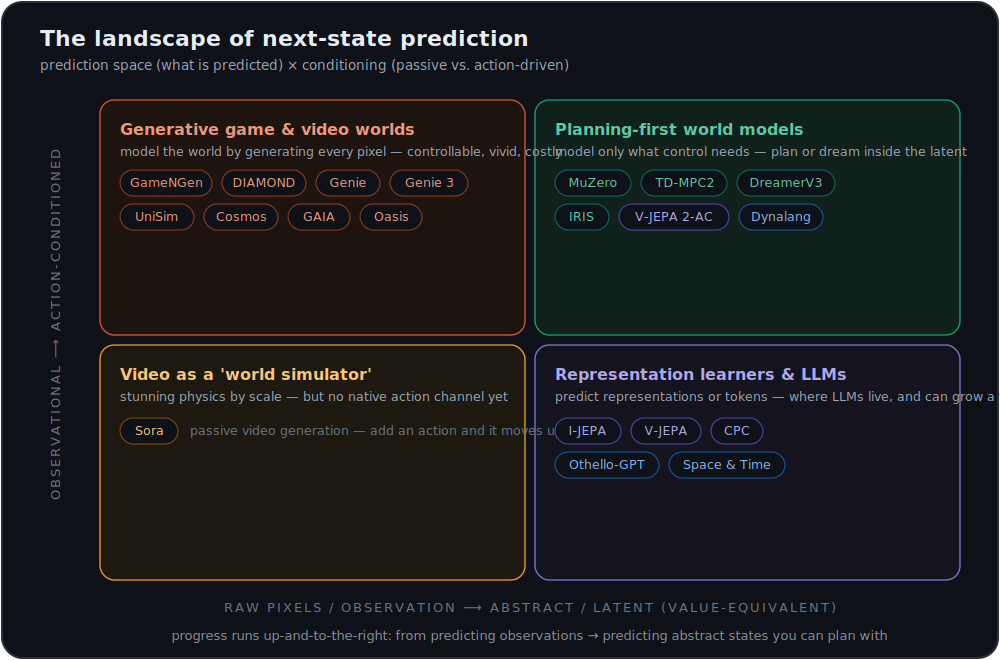
</div>

- **Top-left — pixel + interventional:** generative *game/video* world models (GameNGen, DIAMOND, Genie, Cosmos). Beautiful, controllable, expensive; they model everything, relevant or not.
- **Top-right — abstract + interventional:** *planning-first* models (MuZero, TD-MPC2, V-JEPA 2-AC). They model only what control needs. This is where most people think the frontier of *useful* world models lives.
- **Bottom-left — pixel + observational:** large *video* models pitched as world simulators (Sora). Stunning physics-by-scale, but no native action channel.
- **Bottom-right — latent + observational:** *representation learners* (I-JEPA, CPC) and, interestingly, **LLMs** — which sit here because text is a symbolic observation with no action. Othello-GPT shows this corner can *grow* into a world model on its own.

> The arrow of progress runs **up and to the right**: from passively predicting observations toward actively predicting abstract states you can plan with.

---

## The Next-State Ladder

A capability ladder for "how good is your next-state prediction?" — useful for placing any new paper at a glance.

<div align="center">
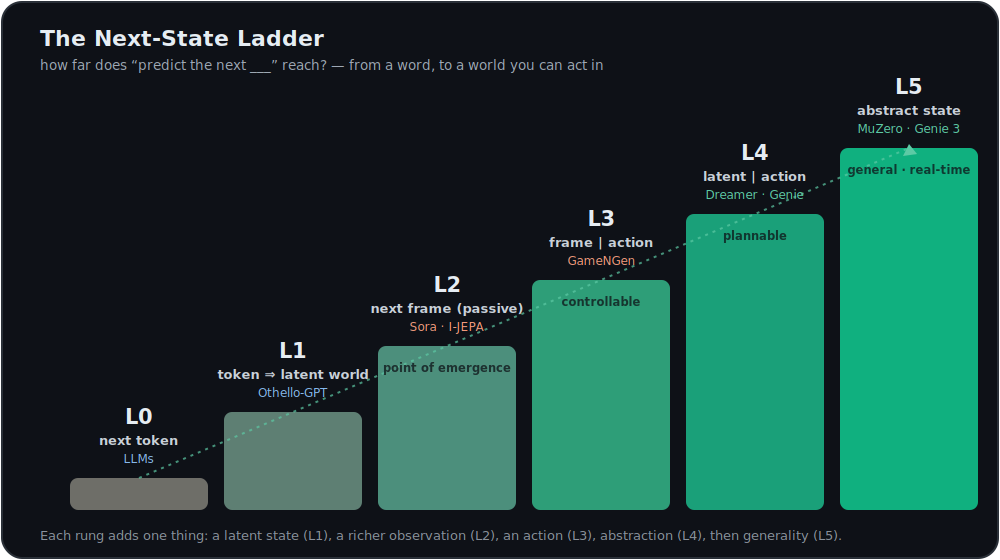
</div>

| Level | What the system predicts | Representative work |
|-------|--------------------------|---------------------|
| **L0** | Next **token** of human text | GPT-style LLMs |
| **L1** | Next token that *implies* a latent world state | [Othello-GPT](#llms-as-implicit-world-models), [Space & Time](#llms-as-implicit-world-models) |
| **L2** | Next **frame / observation** (passive) | [Sora](#generative-video--game-world-models), [I-JEPA](#self-predictive--non-generative-jepa-family) |
| **L3** | Next **frame conditioned on an action** | [GameNGen](#generative-video--game-world-models), [World Models](#latent-world-models-for-control) |
| **L4** | Next **compressed latent**, action-conditioned, plannable | [Dreamer](#latent-world-models-for-control), [IRIS](#latent-world-models-for-control), [Genie](#generative-video--game-world-models) |
| **L5** | Next **abstract / value-equivalent** state, general & real-time | [MuZero](#latent-world-models-for-control), [TD-MPC2](#latent-world-models-for-control), [DreamerV3](#latent-world-models-for-control), [Genie 3](#generative-video--game-world-models), [V-JEPA 2-AC](#self-predictive--non-generative-jepa-family) |

---

## How to read every entry

Each work below carries a one-line **next-state tag** so you can scan the field by *what it actually predicts*:

> 🟢 **Next state:** *the representation it predicts* · **Space:** `latent` · **Cond:** `interventional` · **Unc:** `categorical` · **Obj:** `reconstruction`

- **Space** — `text` · `pixel` · `token` · `latent` · `abstract`
- **Cond** (conditioning) — `observational` (no actions) · `interventional` (action-conditioned)
- **Unc** (uncertainty) — `deterministic` · `softmax` · `gaussian` · `categorical` · `diffusion` · `energy`
- **Obj** (objective) — `reconstruction` · `value-equivalent` · `contrastive` · `energy` · `likelihood`

---

## Landmark figures

*Eight marquee systems, each with a representative figure from its paper or project page. On the [interactive site](https://chaoyue0307.github.io/awesome-next-state-prediction/), every one of the 49 cards also carries a schematic of its state turning into the next.*

|  |  |
|:--|:--|
| [**Genie 3**](https://deepmind.google/blog/genie-3-a-new-frontier-for-world-models/) — real-time interactive worlds<br>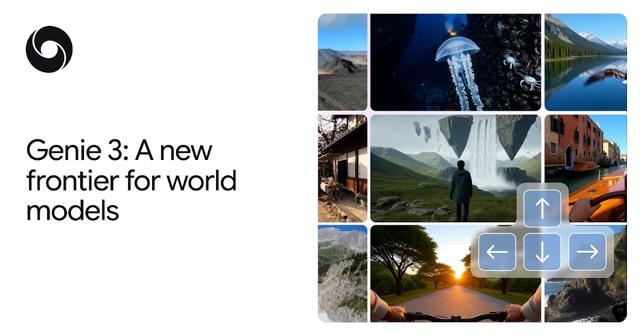 | [**DreamerV3**](https://www.nature.com/articles/s41586-025-08744-2) — one agent, 150+ tasks<br>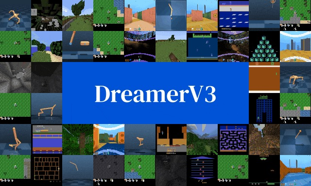 |
| [**MuZero**](https://arxiv.org/abs/1911.08265) — value-equivalent planning<br>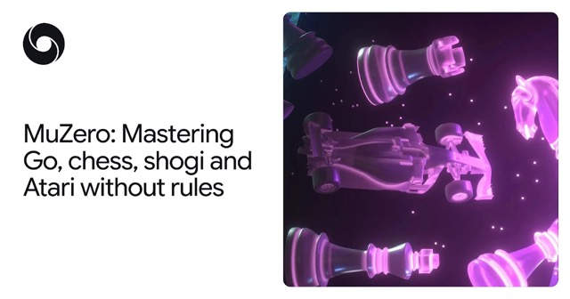 | [**DIAMOND**](https://arxiv.org/abs/2405.12399) — diffusion world model (animated)<br>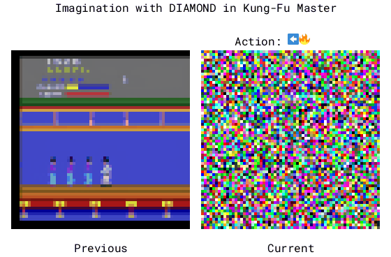 |
| [**GameNGen**](https://arxiv.org/abs/2408.14837) — the network *is* the game engine<br>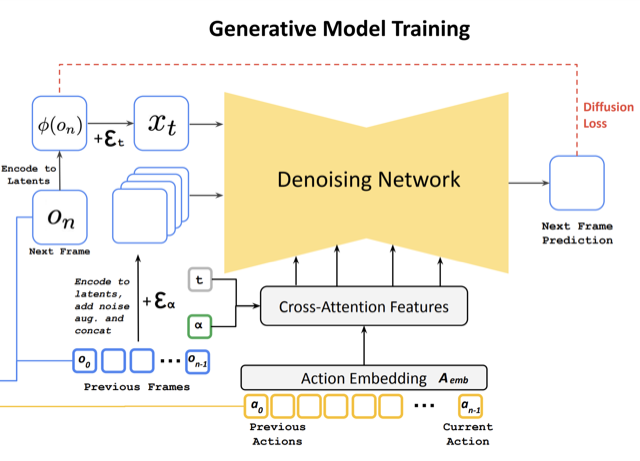 | [**TD-MPC2**](https://arxiv.org/abs/2310.16828) — decoder-free latent control<br>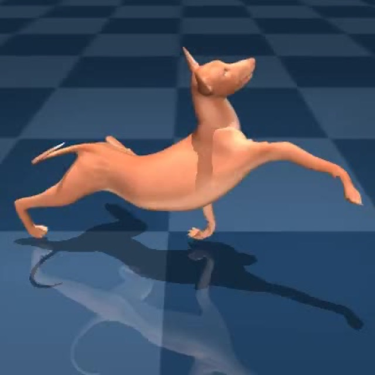 |
| [**Genie 2**](https://deepmind.google/discover/blog/genie-2-a-large-scale-foundation-world-model/) — 3D worlds from one image<br>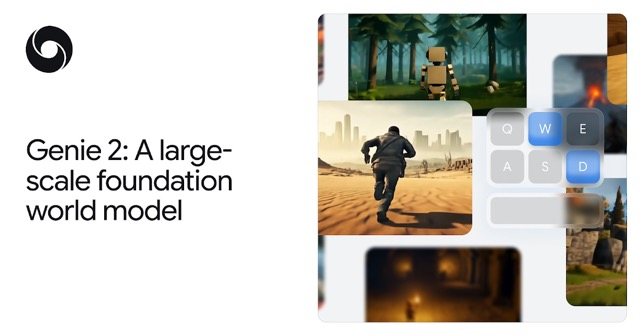 | [**World Models**](https://arxiv.org/abs/1803.10122) — the original VAE + RNN<br>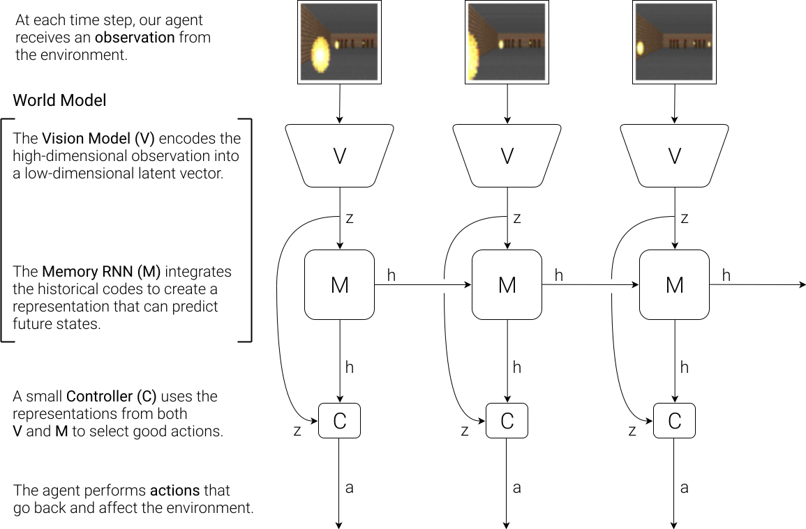 |

> *Figures are © their respective authors and labs, reproduced here at thumbnail scale for non-commercial, educational indexing, each linked to its source. If you are an author and would prefer your figure not appear, open an issue and it will be removed.*

---

# The collection

> Ordered roughly by lineage within each section. ⭐ marks a field-defining landmark.

## Neuroscience & cognitive science

*Minds were the first world models. The brain looks strikingly like a next-state predictor — and the same math (successor representations, predictive coding) keeps reappearing in machines.*

- ⭐ **[Mental Models](https://en.wikipedia.org/wiki/Mental_model)** — Kenneth Craik, 1943, *The Nature of Explanation*. The founding claim: an organism that carries a "small-scale model" of reality can try out alternatives and react before events happen.
  > 🟢 **Next state:** a model of reality run in the head to anticipate events · **Space:** `latent` · **Cond:** `interventional`
- **[Predictive Coding](https://en.wikipedia.org/wiki/Predictive_coding)** — Rao & Ballard, 1999, *Nature Neuroscience*. The cortex as a hierarchy that predicts its next input top-down and propagates only the error.
  > 🟢 **Next state:** next sensory input; only prediction error flows upward · **Space:** `latent` · **Cond:** `observational`
- **[The Successor Representation](https://scholar.google.com/scholar?q=Dayan+1993+successor+representation)** — Peter Dayan, 1993, *Neural Computation*. Represent each state by its *expected discounted future occupancy* — predict where you'll be, not what you'll see. The idea that quietly underwrites half this list.
  > 🟢 **Next state:** expected future state-occupancy (a predictive map) · **Space:** `abstract` · **Cond:** `interventional` · **Obj:** `value-equivalent`
- ⭐ **[The Hippocampus as a Predictive Map](https://scholar.google.com/scholar?q=The+hippocampus+as+a+predictive+map+Stachenfeld)** — Stachenfeld et al., 2017, *Nature Neuroscience*. Place and grid cells appear to encode the successor representation — the brain's spatial memory as a learned next-state predictor.
  > 🟢 **Next state:** successor representation of future locations · **Space:** `abstract` · **Cond:** `interventional`
- **[Free-Energy Principle](https://en.wikipedia.org/wiki/Free_energy_principle)** — Karl Friston, 2010. Active inference: perception *and* action both work to minimize the surprise of a generative model.
  > 🟢 **Next state:** generative model minimizing variational free energy · **Space:** `latent` · **Cond:** `interventional`
- **[The Tolman–Eichenbaum Machine](https://scholar.google.com/scholar?q=Tolman-Eichenbaum+Machine)** — Whittington et al., 2020, *Cell*. Cognitive maps as factorized abstract structure bound to sensory observations — a biologically grounded world model.
  > 🟢 **Next state:** next location in an abstract relational map · **Space:** `abstract` · **Cond:** `interventional`
- **[Predictive Representations: Building Blocks of Intelligence](https://arxiv.org/abs/2402.06590)** — Carvalho et al., 2024. A review tying the successor representation across reinforcement learning, neuroscience, and world models — the cleanest bridge between the brain and the machine sides of this list.
  > 🟢 **Next state:** the successor representation as a shared substrate · **Space:** `abstract` · **Cond:** `interventional`

## Algorithmic precursors

*Before deep learning, the model-based idea was already complete: learn the dynamics, then plan inside them.*

- ⭐ **[Dyna](http://incompleteideas.net/papers/Sutton-91-SB.pdf)** — Richard Sutton, 1991. The blueprint for model-based RL: learn a transition model, then *plan inside it* between real steps.
  > 🟢 **Next state:** learned transition model replayed for planning · **Space:** `abstract` · **Cond:** `interventional`
- **[World Models, Planning & Curiosity](https://people.idsia.ch/~juergen/world-models-planning-curiosity-fki-1990.html)** — Jürgen Schmidhuber, 1990. Coupled controller/world-model RNNs and intrinsic curiosity — decades ahead of their hardware.
  > 🟢 **Next state:** next sensory vector from a recurrent model · **Space:** `latent` · **Cond:** `interventional`

## Latent world models for control

*The mainline of model-based RL: compress observations into a latent state, predict the next latent given an action, and learn behavior by planning or dreaming inside it.*

- ⭐ **[World Models](https://arxiv.org/abs/1803.10122)** — Ha & Schmidhuber, 2018, *NeurIPS*. The paper that coined the modern term. A VAE compresses frames; an MDN-RNN predicts the next latent; a tiny controller is evolved entirely "inside the dream."
  > 🟢 **Next state:** next VAE latent `z` via a mixture-density RNN · **Space:** `latent` · **Cond:** `interventional` · **Unc:** `gaussian`
- ⭐ **[PlaNet](https://arxiv.org/abs/1811.04551)** — Hafner et al., 2019, *ICML*. The Recurrent State-Space Model (RSSM): a deterministic path + a stochastic latent, planned online from pixels.
  > 🟢 **Next state:** next RSSM latent (deterministic `h` + stochastic `z`) · **Space:** `latent` · **Cond:** `interventional`
- ⭐ **[Dreamer](https://arxiv.org/abs/1912.01603)** — Hafner et al., 2020, *ICLR*. Learns behavior by backpropagating through *imagined* latent rollouts.
  > 🟢 **Next state:** next RSSM latent; policy trained on imagined futures · **Space:** `latent` · **Cond:** `interventional`
- **[DreamerV2](https://arxiv.org/abs/2010.02193)** — Hafner et al., 2021, *ICLR*. Switched to **discrete categorical latents** and became the first to hit human-level Atari from a separately learned world model.
  > 🟢 **Next state:** next categorical latent (32×32 one-hots) · **Space:** `latent` · **Cond:** `interventional` · **Unc:** `categorical`
- ⭐ **[DreamerV3](https://www.nature.com/articles/s41586-025-08744-2)** — Hafner et al., 2023 (*Nature*, 2025). One configuration across 150+ tasks; the first agent to **mine diamonds in Minecraft from scratch**, no human data.
  > 🟢 **Next state:** next categorical latent + reward + continue flag · **Space:** `latent` · **Cond:** `interventional` · **Unc:** `categorical`
- **[SimPLe](https://arxiv.org/abs/1903.00374)** — Kaiser et al., 2019, *ICLR*. Showed a stochastic *video* predictor can drive sample-efficient Atari control.
  > 🟢 **Next state:** next video frame from a stochastic pixel model · **Space:** `pixel` · **Cond:** `interventional`
- ⭐ **[MuZero](https://arxiv.org/abs/1911.08265)** — Schrittwieser et al., 2020, *Nature*. The purest statement of **value-equivalence**: never reconstruct observations; model only an abstract state sufficient to predict reward, value, and policy.
  > 🟢 **Next state:** next **abstract** state — only what planning needs · **Space:** `abstract` · **Cond:** `interventional` · **Obj:** `value-equivalent`
- **[EfficientZero](https://arxiv.org/abs/2111.00210)** — Ye et al., 2021, *NeurIPS*. First *super-human* Atari at 100k frames (≈2 hours of play) by adding a self-supervised consistency loss to MuZero.
  > 🟢 **Next state:** next abstract MuZero state with consistency loss · **Space:** `abstract` · **Cond:** `interventional` · **Obj:** `value-equivalent`
- **[TD-MPC2](https://arxiv.org/abs/2310.16828)** — Hansen et al., 2024, *ICLR*. A **decoder-free** implicit latent model + model-predictive control; one agent scales across 80+ continuous-control tasks.
  > 🟢 **Next state:** next latent with **no decoder** — purely task-oriented · **Space:** `abstract` · **Cond:** `interventional` · **Obj:** `value-equivalent`
- **[IRIS](https://arxiv.org/abs/2209.00588)** — Micheli et al., 2023, *ICLR*. Tokenize frames with a VQ autoencoder, then run a Transformer world model — LLM machinery, applied to control.
  > 🟢 **Next state:** next discrete image token, autoregressive · **Space:** `token` · **Cond:** `interventional` · **Unc:** `softmax`
- **[DayDreamer](https://arxiv.org/abs/2206.14176)** — Wu et al., 2022, *CoRL*. Dreamer in the physical world — real robots learning online in hours.
  > 🟢 **Next state:** next latent learned online on real robots · **Space:** `latent` · **Cond:** `interventional`
- **[iVideoGPT](https://arxiv.org/abs/2405.15223)** — Wu et al., 2024, *NeurIPS*. A scalable *interactive* world model: tokenize visual observations, actions, and rewards into one sequence and predict the next token — LLM machinery over embodied experience.
  > 🟢 **Next state:** next visual / action / reward token (compressive tokenization) · **Space:** `token` · **Cond:** `interventional` · **Unc:** `softmax`

## Self-predictive & non-generative (JEPA family)

*The opposite bet from generation: don't reconstruct the future — predict its **representation**. Cheaper, more abstract, and (claimed) closer to how brains predict.*

- **[Contrastive Predictive Coding (CPC)](https://arxiv.org/abs/1807.03748)** — van den Oord et al., 2018. Predict the future in latent space by *contrast* (InfoNCE), never by reconstruction — the seed of the whole non-generative line.
  > 🟢 **Next state:** next latent identified by contrast, not reconstructed · **Space:** `latent` · **Cond:** `observational` · **Obj:** `contrastive`
- **[Self-Predictive Representations (SPR)](https://arxiv.org/abs/2007.05929)** — Schwarzer et al., 2021, *ICLR*. Predict your own latents *k* steps ahead (BYOL-style); a huge sample-efficiency boost with no pixel decoding.
  > 🟢 **Next state:** next latent predicted k steps ahead, no decoder · **Space:** `latent` · **Cond:** `interventional` · **Obj:** `contrastive`
- **[Deep Bisimulation for Control](https://arxiv.org/abs/2006.10742)** — Zhang et al., 2020, *ICLR*. Learn a latent metric in which two states are close *iff* their futures-under-policy match — discard everything behavior-irrelevant.
  > 🟢 **Next state:** a latent where distance = difference in future behavior · **Space:** `abstract` · **Cond:** `interventional` · **Obj:** `value-equivalent`
- ⭐ **[A Path Towards Autonomous Machine Intelligence](https://openreview.net/forum?id=BZ5a1r-kVsf)** — Yann LeCun, 2022. The manifesto for **Joint-Embedding Predictive Architectures**: predict in representation space, hierarchically, with energy — never pixels.
  > 🟢 **Next state:** next abstract representation via a JEPA · **Space:** `latent` · **Cond:** `interventional` · **Obj:** `energy`
- ⭐ **[I-JEPA](https://arxiv.org/abs/2301.08243)** — Assran et al., 2023, *CVPR*. JEPA for images: predict the *representations* of masked blocks from context. Strong semantic features, zero reconstruction.
  > 🟢 **Next state:** representations of masked image blocks · **Space:** `latent` · **Cond:** `observational` · **Obj:** `energy`
- **[V-JEPA](https://arxiv.org/abs/2404.08471)** — Bardes et al., 2024, *Meta AI*. Feature prediction from video alone yields versatile motion-aware representations — no labels, text, or reconstruction.
  > 🟢 **Next state:** features of masked spatio-temporal video regions · **Space:** `latent` · **Cond:** `observational` · **Obj:** `energy`
- ⭐ **[V-JEPA 2 & V-JEPA 2-AC](https://arxiv.org/abs/2506.09985)** — Meta AI, 2025. 1M+ hours of video pretraining, then a 300M-param **action-conditioned** latent world model that lets real Franka arms plan pick-and-place **zero-shot** in unseen labs.
  > 🟢 **Next state:** next video-frame *representation* conditioned on an action · **Space:** `latent` · **Cond:** `interventional` · **Obj:** `energy`

## Generative video & game world models

*Model the world by generating it. These predict the next frame — often action-conditioned and in real time — and increasingly behave like learned game engines and simulators.*

- **[GAIA-1](https://arxiv.org/abs/2309.17080)** — Wayve, 2023. Driving world model that casts the problem as next-token prediction over video + text + action.
  > 🟢 **Next state:** next driving-scene token, autoregressive · **Space:** `token` · **Cond:** `interventional` · **Unc:** `softmax`
- ⭐ **[UniSim](https://arxiv.org/abs/2310.06114)** — Yang et al., 2024, *ICLR Outstanding Paper*. A *universal simulator* of real-world interaction; policies and planners trained purely inside it transfer to the real world zero-shot.
  > 🟢 **Next state:** next observation given instruction or low-level control · **Space:** `pixel` · **Cond:** `interventional` · **Unc:** `diffusion`
- **[Sora](https://openai.com/index/video-generation-models-as-world-simulators/)** — OpenAI, 2024. Video diffusion at scale, explicitly framed as a "world simulator." Emergent physics from scale — but no native action channel.
  > 🟢 **Next state:** next spacetime-patch latent via diffusion Transformer · **Space:** `pixel` · **Cond:** `observational` · **Unc:** `diffusion`
- ⭐ **[Genie](https://arxiv.org/abs/2402.15391)** — Google DeepMind, 2024, *ICML*. 11B foundation world model that learns a **latent action** space from *unlabeled* video — controllability with no action labels.
  > 🟢 **Next state:** next frame conditioned on a *learned latent action* · **Space:** `token` · **Cond:** `interventional` · **Unc:** `softmax`
- **[GameNGen](https://arxiv.org/abs/2408.14837)** — Google, 2024. A neural network *is* the game engine: playable DOOM, next frame via diffusion at 20 FPS conditioned on past frames + actions.
  > 🟢 **Next state:** next DOOM frame via diffusion, real time · **Space:** `pixel` · **Cond:** `interventional` · **Unc:** `diffusion`
- ⭐ **[DIAMOND](https://arxiv.org/abs/2405.12399)** — Alonso et al., 2024, *NeurIPS*. The counter-argument to discrete latents: *visual details matter for RL*, so reconstruct the next frame with **diffusion** — and beat token-based world models.
  > 🟢 **Next state:** next frame via diffusion (keeps fine visual detail) · **Space:** `pixel` · **Cond:** `interventional` · **Unc:** `diffusion`
- **[Oasis](https://www.decart.ai/articles/oasis-interactive-ai-video-game-model)** — Decart & Etched, 2024. A fully generated, real-time playable Minecraft-like world — no game code underneath, only a diffusion world model.
  > 🟢 **Next state:** next playable frame from keypresses, real time · **Space:** `pixel` · **Cond:** `interventional` · **Unc:** `diffusion`
- **[Genie 2](https://deepmind.google/discover/blog/genie-2-a-large-scale-foundation-world-model/)** — Google DeepMind, 2024. Minute-scale, action-controllable, consistent 3D environments generated from a single image.
  > 🟢 **Next state:** next frame of a 3D world from one image prompt · **Space:** `pixel` · **Cond:** `interventional` · **Unc:** `diffusion`
- **[Cosmos](https://arxiv.org/abs/2501.03575)** — NVIDIA, 2025. An open *world foundation model* platform — pretrained models + video tokenizers — aimed at Physical AI (robotics, AV).
  > 🟢 **Next state:** next physical-scene state for downstream Physical AI · **Space:** `pixel` · **Cond:** `interventional` · **Unc:** `diffusion`
- **[GAIA-2](https://arxiv.org/abs/2503.20523)** — Wayve, 2025. Controllable, multi-camera generative world model for autonomous driving, with editable ego and agent behavior.
  > 🟢 **Next state:** next multi-view driving scene, controllable · **Space:** `pixel` · **Cond:** `interventional` · **Unc:** `diffusion`
- ⭐ **[Genie 3](https://deepmind.google/blog/genie-3-a-new-frontier-for-world-models/)** — Google DeepMind, 2025. The first **real-time, general-purpose interactive** world model — minutes-long, persistent 3D worlds at 720p/24 FPS. Public as *Project Genie* in 2026.
  > 🟢 **Next state:** next frame of a real-time, persistent 3D world · **Space:** `pixel` · **Cond:** `interventional` · **Unc:** `diffusion`

*Driving & robotics — world models grounded in the physical world:*

- **[DriveDreamer](https://arxiv.org/abs/2309.09777)** — Wang et al., 2023, *ECCV 2024*. A driving world model learned entirely from real-world video, predicting future frames conditioned on driving actions.
  > 🟢 **Next state:** next driving-video frame, action-conditioned · **Space:** `pixel` · **Cond:** `interventional` · **Unc:** `diffusion`
- **[Vista](https://arxiv.org/abs/2405.17398)** — OpenDriveLab, 2024, *NeurIPS*. Generalizable, high-fidelity, long-horizon driving world model with multi-modal action control and a built-in reward function.
  > 🟢 **Next state:** high-fidelity next driving frame under varied controls · **Space:** `pixel` · **Cond:** `interventional` · **Unc:** `diffusion`
- **[RoboDreamer](https://arxiv.org/abs/2404.12377)** — Zhou et al., 2024, *ICML*. A *compositional* world model that factorizes video generation through language primitives, so it can imagine plans for unseen object/action combinations.
  > 🟢 **Next state:** next video of a robot plan, composed from primitives · **Space:** `pixel` · **Cond:** `interventional` · **Unc:** `diffusion`

## LLMs as implicit world models

*The honest counter-weight to the thesis: next-token prediction, done well enough, grows latent world structure on its own — and LLMs can be repurposed as world models for planning.*

- ⭐ **[Emergent World Representations (Othello-GPT)](https://arxiv.org/abs/2210.13382)** — Li et al., 2023, *ICLR*. Train a Transformer on nothing but legal Othello *moves*; a linear probe then recovers the actual **board state** it was never told. The cleanest evidence that prediction induces a world model.
  > 🟢 **Next state:** next move token — but a latent **board** emerges inside · **Space:** `text` · **Cond:** `observational` · **Obj:** `likelihood`
- **[Language Models Represent Space and Time](https://arxiv.org/abs/2310.02207)** — Gurnee & Tegmark, 2024, *ICLR*. LLMs encode real-world coordinates and dates as linear directions — literal maps and timelines as a byproduct of prediction.
  > 🟢 **Next state:** linear world-coordinate / time features inside an LLM · **Space:** `text` · **Cond:** `observational` · **Obj:** `likelihood`
- **[Reasoning via Planning (RAP)](https://arxiv.org/abs/2305.14992)** — Hao et al., 2023, *EMNLP*. Repurpose an LLM as its *own* world model and search over predicted reasoning states with MCTS.
  > 🟢 **Next state:** the next reasoning state, predicted by the LLM itself · **Space:** `text` · **Cond:** `interventional` · **Obj:** `likelihood`
- **[Dynalang](https://arxiv.org/abs/2308.01399)** — Lin et al., 2023, *ICML 2024*. Treats language as something to *predict*, not obey: folds future text and pixels into one Dreamer-style multimodal world model.
  > 🟢 **Next state:** next multimodal latent predicting future text **and** pixels · **Space:** `latent` · **Cond:** `interventional` · **Unc:** `categorical`

## Surveys & meta

- ⭐ **[Understanding World or Predicting Future? A Comprehensive Survey of World Models](https://arxiv.org/abs/2411.14499)** — Ding et al. (Tsinghua), 2025, *ACM Computing Surveys*. The most complete current survey, with a dual *understand-vs-predict* taxonomy. Companion list: [tsinghua-fib-lab/World-Model](https://github.com/tsinghua-fib-lab/World-Model).
- **[A Comprehensive Survey on World Models for Embodied AI](https://arxiv.org/abs/2510.16732)** — 2025. World models specifically for robotics and embodied control.
- **[3D & 4D World Modeling: A Survey](https://arxiv.org/abs/2509.07996)** — 2025. Where generative world models meet explicit geometry and time.

---

## Comparison table

The same works, side by side, on the [Five Axes](#the-five-axes-of-next-state-prediction). Sort this by any column on the **[interactive site](https://chaoyue0307.github.io/awesome-next-state-prediction/)**.

| Work | Year | Group | Next-state representation | Space | Cond. | Uncertainty | Objective | Ladder |
|------|:----:|-------|---------------------------|:-----:|:-----:|:-----------:|:---------:|:------:|
| World Models | 2018 | control | next VAE latent (MDN-RNN) | latent | act | gaussian | reconstruction | L3 |
| PlaNet | 2019 | control | next RSSM latent | latent | act | gaussian | reconstruction | L4 |
| Dreamer | 2020 | control | imagined RSSM latent | latent | act | gaussian | reconstruction | L4 |
| DreamerV2 | 2021 | control | categorical latent | latent | act | categorical | reconstruction | L4 |
| DreamerV3 | 2023 | control | categorical latent + reward | latent | act | categorical | reconstruction | L5 |
| SimPLe | 2019 | control | next video frame | pixel | act | diffusion | reconstruction | L3 |
| MuZero | 2020 | control | abstract value-equiv. state | abstract | act | deterministic | value-equivalent | L5 |
| EfficientZero | 2021 | control | abstract state + consistency | abstract | act | deterministic | value-equivalent | L5 |
| TD-MPC2 | 2024 | control | decoder-free latent | abstract | act | deterministic | value-equivalent | L5 |
| IRIS | 2023 | control | discrete image token | token | act | softmax | reconstruction | L4 |
| DayDreamer | 2022 | control | online real-robot latent | latent | act | categorical | reconstruction | L4 |
| CPC | 2018 | jepa | contrastive future latent | latent | obs | energy | contrastive | L2 |
| SPR | 2021 | jepa | k-step self-predicted latent | latent | act | energy | contrastive | L3 |
| Deep Bisimulation | 2020 | jepa | behavior-equivalent latent | abstract | act | deterministic | value-equivalent | L4 |
| LeCun / JEPA | 2022 | jepa | abstract representation | latent | act | energy | energy | L5 |
| I-JEPA | 2023 | jepa | masked-block representation | latent | obs | energy | energy | L2 |
| V-JEPA | 2024 | jepa | masked video features | latent | obs | energy | energy | L3 |
| V-JEPA 2-AC | 2025 | jepa | action-cond. frame features | latent | act | energy | energy | L5 |
| GAIA-1 | 2023 | video | driving-scene token | token | act | softmax | reconstruction | L4 |
| UniSim | 2024 | video | next observation (control/instr.) | pixel | act | diffusion | reconstruction | L4 |
| Sora | 2024 | video | spacetime-patch latent | pixel | obs | diffusion | reconstruction | L2 |
| Genie | 2024 | video | frame + latent action | token | act | softmax | reconstruction | L4 |
| GameNGen | 2024 | video | next DOOM frame | pixel | act | diffusion | reconstruction | L3 |
| DIAMOND | 2024 | video | next frame (diffusion) | pixel | act | diffusion | reconstruction | L4 |
| Oasis | 2024 | video | playable next frame | pixel | act | diffusion | reconstruction | L3 |
| Genie 2 | 2024 | video | 3D world from one image | pixel | act | diffusion | reconstruction | L4 |
| Cosmos | 2025 | video | physical-scene state | pixel | act | diffusion | reconstruction | L4 |
| GAIA-2 | 2025 | video | multi-view driving scene | pixel | act | diffusion | reconstruction | L4 |
| Genie 3 | 2025 | video | real-time persistent 3D frame | pixel | act | diffusion | reconstruction | L5 |
| Othello-GPT | 2023 | llm | move token (latent board emerges) | text | obs | softmax | likelihood | L1 |
| LMs Represent Space & Time | 2024 | llm | linear world/time features | text | obs | softmax | likelihood | L1 |
| RAP | 2023 | llm | next reasoning state | text | act | softmax | likelihood | L3 |
| Dynalang | 2023 | llm | multimodal text+pixel latent | latent | act | categorical | reconstruction | L4 |
| Successor Representation | 1993 | neuro | expected future state-occupancy | abstract | act | deterministic | value-equivalent | L3 |
| Hippocampus Predictive Map | 2017 | neuro | SR of future locations | abstract | act | gaussian | value-equivalent | L3 |
| DriveDreamer | 2023 | video | next driving frame | pixel | act | diffusion | reconstruction | L4 |
| iVideoGPT | 2024 | control | visual/action/reward token | token | act | softmax | reconstruction | L4 |
| RoboDreamer | 2024 | video | composed robot-plan video | pixel | act | diffusion | reconstruction | L4 |
| Vista | 2024 | video | hi-fi driving frame | pixel | act | diffusion | reconstruction | L4 |

---

## Timeline

```
1943  ● Craik — mental models (the idea)
1990  ● Schmidhuber — RNN world models + curiosity
1991  ● Sutton — Dyna (model-based RL blueprint)
1993  ● Dayan — successor representation (predict where you'll be)
1999  ● Rao & Ballard — predictive coding (the brain)
2010  ● Friston — free-energy principle
2017  ● Stachenfeld — the hippocampus as a predictive map
2018  ● Ha & Schmidhuber — "World Models"  │  CPC
2019  ● PlaNet (RSSM)  │  SimPLe
2020  ● Dreamer  │  MuZero (value-equivalence)  │  Tolman–Eichenbaum Machine  │  Bisimulation
2021  ● DreamerV2 (categorical)  │  EfficientZero  │  SPR
2022  ● LeCun JEPA manifesto  │  DayDreamer  │  Othello-GPT
2023  ● DreamerV3  │  IRIS  │  I-JEPA  │  GAIA-1  │  RAP  │  Dynalang  │  DriveDreamer
2024  ● Sora  │  Genie  │  GameNGen  │  DIAMOND  │  V-JEPA  │  TD-MPC2  │  UniSim  │  Vista  │  RoboDreamer  │  iVideoGPT
2025  ● Cosmos  │  GAIA-2  │  V-JEPA 2-AC  │  Genie 3  │  DreamerV3 → Nature
2026  ● Genie 3 public (Project Genie) · the real-time interactive world model era
```

---

## Open problems & frontiers

The questions that decide whether world models become the substrate of general agents:

1. **Pixels vs. abstraction — the unresolved schism.** [JEPA](#self-predictive--non-generative-jepa-family) says reconstruction is a waste; [DIAMOND](#generative-video--game-world-models) shows detail matters for control. Nobody knows the right altitude to predict at, and it may be task-dependent.
2. **Long-horizon consistency.** Generative world models drift and hallucinate over long rollouts. [Genie 3](#generative-video--game-world-models) holds minutes; agents need hours, with object permanence and stable physics.
3. **Compounding error.** Autoregressive rollout amplifies small per-step errors. Planning depth is bounded by where the model stops being trustworthy.
4. **Calibrated, multimodal uncertainty.** The future branches. Does the model *know* it's uncertain, and can a planner use that? Diffusion and energy models are bets; calibration is open.
5. **Action grounding at scale.** The web has trillions of *un-actioned* video frames. [Genie](#generative-video--game-world-models)'s latent actions and [V-JEPA 2-AC](#self-predictive--non-generative-jepa-family)'s few-hour action tuning are early answers to "how do we add Axis 2 cheaply?"
6. **Temporal & hierarchical abstraction.** Predicting every frame is the wrong granularity. We want to predict the *consequence* of an action that unfolds over many steps — open since the options framework.
7. **Evaluation.** What is the loss for a *good* world model? Pixel MSE rewards the wrong thing; "is it useful for planning/control" is the real metric but hard to measure. See the [survey](#surveys--meta).
8. **The grounding ceiling of text.** How far does next-token prediction's implicit world model actually reach — and where must sensorimotor experience take over?

---

## How to read a world-model paper

A 60-second checklist — answer these five and you understand any new system, and exactly how it differs from an LLM:

1. **State** — what is the state vector? (token / pixel / latent / abstract)
2. **Action** — is the next state conditioned on an action? *If not, it's closer to an LLM than a world model.*
3. **Space** — does it predict in observation space or representation space?
4. **Uncertainty** — how does it represent a *distribution* over next states?
5. **Objective** — is it trained to reconstruct, or to be useful for planning?

---

## Glossary

- **World model** — a learned model of environment dynamics, $P(s_{t+1}\mid s_t, a_t)$, used to predict, plan, or generate.
- **RSSM** — Recurrent State-Space Model; a deterministic recurrent path plus a stochastic latent (PlaNet/Dreamer).
- **Value-equivalence** — modeling only what's needed to predict value/reward/policy, not observations (MuZero).
- **JEPA** — Joint-Embedding Predictive Architecture; predicts *representations* of the future, not pixels.
- **Latent action** — an action space *inferred* from unlabeled video so frames become controllable (Genie).
- **Observational vs. interventional** — predicting what usually follows vs. the consequence of an action (`do(·)`); correlation vs. causation.
- **Imagination / dreaming** — training a policy on rollouts generated by the world model instead of the real environment.
- **Compounding error** — the accumulation of per-step prediction error over an autoregressive rollout.

---

## Contributing

PRs very welcome — this is meant to be the *living* reference for next-state prediction. Please keep the **next-state tag** on every entry (that discipline is the point of the list). See **[CONTRIBUTING.md](CONTRIBUTING.md)** for the entry format and the one rule that matters: *say what each system treats as the next state.*

## Citation

```bibtex
@misc{awesome-next-state-prediction,
  title        = {Awesome Next-State Prediction: A Curated Map of World Models},
  author       = {He, Chaoyue and contributors},
  year         = {2026},
  howpublished = {\url{https://github.com/ChaoYue0307/awesome-next-state-prediction}}
}
```

## License

[](LICENSE) — released under [CC0 1.0](LICENSE). To the extent possible under law, contributors have waived all copyright and related rights to this curation.

<div align="center">

*Next-token prediction gave us language. Next-state prediction is the bet that it gives us agency.*

</div>
